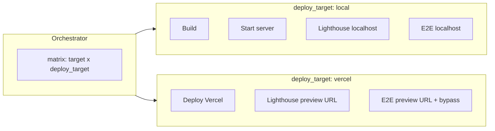

# Plan: Two deploy targets (local + vercel) with dynamic Lighthouse/E2E URL

## Current state

- **Orchestrator** ([staging-orchestrator.yml](.github/workflows/staging-orchestrator.yml)): calls Next.js workflow once per affected app with `deploy_target: "local"`.
- **Next.js workflow** ([staging-w-app-nextjs.yml](.github/workflows/staging-w-app-nextjs.yml)): Build and Start server only when `deploy_target == 'local'`; Lighthouse and E2E run only for local (fixed `APP_URL` / localhost); Deploy to Vercel runs **unconditionally** at the end.

## Target state

- **Orchestrator**: Call Next.js workflow **twice per affected app** — once with `deploy_target: local`, once with `deploy_target: vercel` (matrix over both `target` and `deploy_target`).
- **Next.js workflow**: 
  - **local**: Build, Start server, Lighthouse (url = localhost), Setup Playwright, E2E (localhost). **No** Deploy step.
  - **vercel**: Deploy to Vercel first, then Lighthouse (url = preview URL), Setup Playwright, E2E (preview URL + bypass secret). No local Build/Start server.

Lighthouse and E2E run in **both** paths, with URL coming from either localhost or `steps.deploy.outputs.preview-url`.

---

## 1. Orchestrator: matrix with `deploy_target`

**File:** [.github/workflows/staging-orchestrator.yml](.github/workflows/staging-orchestrator.yml)

- In **call-nextjs**, extend the matrix to include `deploy_target` so each affected app runs twice (local and vercel):

```yaml
strategy:
  fail-fast: false
  matrix:
    target: ${{ fromJson(needs.detect-affected.outputs.nextjs_targets) }}
    deploy_target: [local, vercel]
```

- Pass the matrix value into the workflow: `deploy_target: ${{ matrix.deploy_target }}` (replace the hardcoded `"local"`).

No new outputs or map-step changes; only the matrix and the `with:` for the reusable workflow.

---

## 2. Next.js workflow: gate steps by `deploy_target` and use dynamic URL

**File:** [.github/workflows/staging-w-app-nextjs.yml](.github/workflows/staging-w-app-nextjs.yml)

### 2.1 Deploy only when vercel; run it before Lighthouse

- **Deploy to Vercel Preview**: Move this step **above** the Lighthouse block. Add condition so it runs only when `inputs.deploy_target == 'vercel'`.
- Keep **Build** and **Start server (background)** with `if: inputs.deploy_target == 'local'` (no change to their condition).

Resulting order: Checkout → CI setup → CI validate → Build (if local) → Start server (if local) → **Deploy (if vercel)** → Lighthouse → … → E2E → Upload E2E artifacts.

### 2.2 Run Lighthouse for both paths with dynamic URL

- **Run Lighthouse CI**: 
  - Remove the `if: inputs.deploy_target == 'local'` condition so it runs for both local and vercel.
  - Set the collect URL via an expression: use `http://localhost:3000` when `inputs.deploy_target == 'local'`, and `steps.deploy.outputs.preview-url` when `inputs.deploy_target == 'vercel'`. In the `run` block, pass that URL into `lhci autorun --collect.url="…"` (e.g. `URL="${{ inputs.deploy_target == 'local' && 'http://localhost:3000' || steps.deploy.outputs.preview-url }}"` then use `$URL` in the command).
- **Upload Lighthouse artifacts**: Run for both paths (e.g. `if: always()` and drop the deploy_target check), and keep artifact name including `inputs.target`; consider adding `inputs.deploy_target` to the artifact name so local and vercel don’t overwrite (e.g. `lighthouse-artifacts-${{ inputs.target }}-${{ inputs.deploy_target }}-${{ github.run_number }}`).
- **Write Lighthouse report to job summary**: Run for both paths; use the same report URL output from the Lighthouse step.
- **Comment PR with Lighthouse report**: Run for both paths when it’s a PR. Differentiate comments so local and vercel don’t overwrite each other: e.g. include `deploy_target` in the comment heading (e.g. `## Staging – Next.js (${{ inputs.target }}) – ${{ inputs.deploy_target }}`). In the body, include the Lighthouse link and, when `deploy_target == 'vercel'`, the Vercel preview URL from `steps.deploy.outputs.preview-url`.

### 2.3 E2E and Playwright for both paths

- **Setup Playwright**: Remove `if: inputs.deploy_target == 'local'` so it runs for both local and vercel.
- **Run E2E**: 
  - Run for both paths (remove the `if: inputs.deploy_target == 'local'` condition).
  - Set `BASE_URL` dynamically: when local use `http://localhost:3000`, when vercel use `steps.deploy.outputs.preview-url`.
  - When `deploy_target == 'vercel'`, pass `VERCEL_PROTECTION_BYPASS_SECRET` from secrets into the step’s `env` (E2E helpers already read it; see [tools/e2e/helpers/console-errors.ts](tools/e2e/helpers/console-errors.ts) and [tools/e2e/tests/game-client/smoke.spec.ts](tools/e2e/tests/game-client/smoke.spec.ts)).
- **Upload E2E artifacts on failure**: Run for both paths (e.g. `if: failure()` without deploy_target check). Include `deploy_target` in the artifact name so local and vercel are distinct (e.g. `e2e-artifacts-${{ inputs.target }}-${{ inputs.deploy_target }}-${{ github.run_number }}`).

### 2.4 Secret for Vercel protection bypass

- In the workflow’s `workflow_call` **secrets**, add an optional secret (e.g. `VERCEL_PROTECTION_BYPASS_SECRET`).
- In the orchestrator’s **call-nextjs** job, pass that secret through: `VERCEL_PROTECTION_BYPASS_SECRET: ${{ secrets.VERCEL_PROTECTION_BYPASS_SECRET }}` (if the repo has it configured).

---

## 3. Flow summary




- **Local run**: Validate → Build → Start server → Lighthouse (localhost) → Comment → Setup Playwright → E2E (localhost) → Upload E2E artifacts. No deploy.
- **Vercel run**: Validate → Deploy → Lighthouse (preview URL) → Comment (with preview link) → Setup Playwright → E2E (preview URL + bypass) → Upload E2E artifacts.

---

## 4. Files to touch


| File                                                                                     | Changes                                                                                                                                                                                                                        |
| ---------------------------------------------------------------------------------------- | ------------------------------------------------------------------------------------------------------------------------------------------------------------------------------------------------------------------------------ |
| [.github/workflows/staging-orchestrator.yml](.github/workflows/staging-orchestrator.yml) | Matrix with `deploy_target: [local, vercel]`; pass `deploy_target` and optional `VERCEL_PROTECTION_BYPASS_SECRET`.                                                                                                             |
| [.github/workflows/staging-w-app-nextjs.yml](.github/workflows/staging-w-app-nextjs.yml) | Move Deploy step up and gate with `if: vercel`; run Lighthouse/E2E for both paths with dynamic URL and bypass secret for vercel; update comment and artifact names to include `deploy_target`; add optional secret for bypass. |


---

## 5. Optional / later

- If you want to reduce duplicate comments, you could merge both deploy_target results into a single PR comment per target (e.g. one comment “Staging – Next.js (game-client)” with sections for local and vercel). For the initial “two calls per app” validation, separate comments per (target, deploy_target) are simpler and avoid race conditions between the two jobs.
- After validating, you can revert to a single deploy_target (e.g. only `local`) from the orchestrator if you prefer not to run both on every PR.

