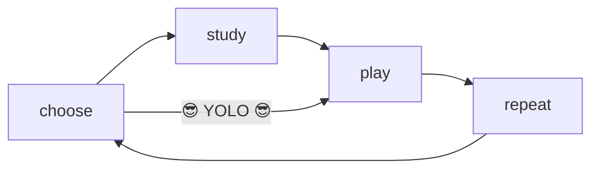

# Product Overview

This document owns the high-level definition, promise, learning experience, and brand identity for `kartuli.app`.

## Product definition

`kartuli.app` is a Georgian language learning app where students practice alphabet, vocabulary and grammar playing short games.

The app is offered via a web app that runs in any device with a modern browser.

## Core promise

When a student has a few free minutes, the app will help them feel:

**"I practiced some Georgian."**

## Learning experience

The learning experience is built around a simple loop:

**choose something to learn -> study (optional) -> play a short game -> repeat**

### Choose what to learn

 Students chan choose what to learn in different ways:
 - get recommended custom lessons based on their activity (repeat items viewed recently, reinforce items already mastered, introduce new items or focus on items they've struggled with)
 - explore curated alphabet or vocabulary lessons
 - create a custom lesson froms the saved items list
 - seasonal lessons: Christmas, Summer, Easter, Halloween...

### Study the items (optional)

Students can review each item with detailed flashcards that include:
- Georgian script
- transliteration
- translation
- images
- audios
- examples
- notes

### Play short games

Games are focused on practicing the items in a fun and engaging way.

Each game is alwaysdifferent and has multiple minigame rounds.

After the game, students can review the items they got wrong, and continue learning by playing again, or choose something else.

## Brand identity

- Brand name: `kartuli.app`
- The primary mascot is a Georgian dog.
- The mascot is the main recurring personality layer across the app.
- The voice stays clear, warm, encouraging, and lightly playful.
- Humor stays small, occasional, and charming rather than noisy or distracting.
- Low-content and recovery states use the mascot to avoid feeling empty or generic.
- Copy stays easy to scan and does not carry all of the personality by itself.
