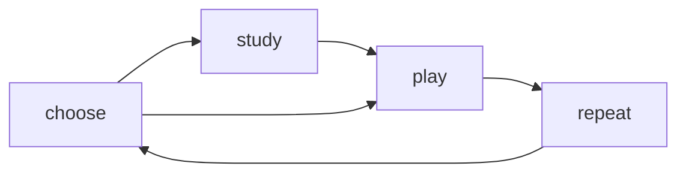

# Product Overview

This document owns the high-level definition, promise, learning experience, and brand identity for `kartuli.app`.

## Product definition

`kartuli.app` is a Georgian language learning app where students practice the Georgian alphabet and vocabulary through short study and play flows.

The app is offered as a web app that runs on any device with a modern browser.

## Core promise

When a student has a few free minutes, the app will help them feel:

**"I practiced some Georgian."**

## Learning experience

The learning experience is built around a simple loop:

**choose something to learn -> study (optional) -> play a short game -> repeat**

### Choose what to learn

Students choose one curated learning resource:

- an alphabet lesson
- a vocabulary lesson
- a `Full review` set for one module

### Study the items (optional)

Students can review the chosen set before Play.

Study shows item summaries and item details, including:

- Georgian script
- transliteration
- translation
- examples
- notes

### Play short games

Play turns the chosen set into a short generated game made of rounds.

The game focuses on practicing the chosen items in a fast, repeatable loop.

After the game, students can review the items they got wrong, play again, or choose something else.

### Supporting utilities

The product also includes:

- `Translit` for Georgian <-> Latin transliteration
- `Settings` for changing the app language

## Brand identity

- Brand name: `kartuli.app`
- The primary mascot is a Georgian dog.
- The mascot is the main recurring personality layer across the app.
- The voice stays clear, warm, encouraging, and lightly playful.
- Humor stays small, occasional, and charming rather than noisy or distracting.
- Low-content and recovery states use the mascot to avoid feeling empty or generic.
- Copy stays easy to scan and does not carry all of the personality by itself.
