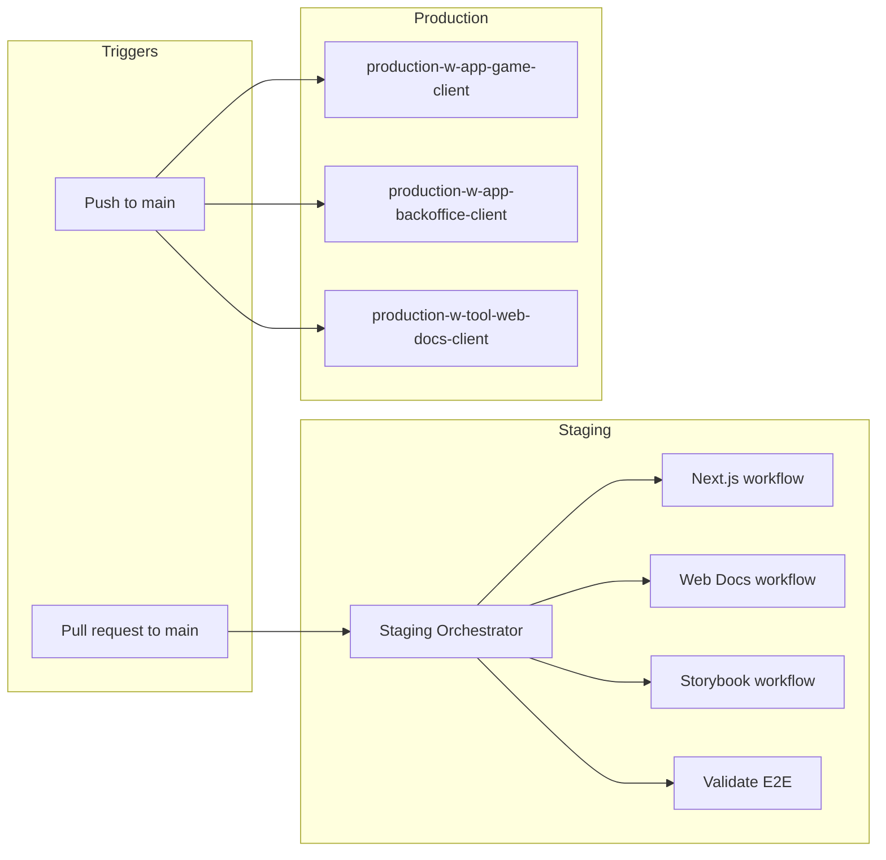

# Pipeline Overview

## When each pipeline runs

| Pipeline | Trigger | Entry point |
|----------|---------|-------------|
| **Staging** | Pull request targeting `main` (and `workflow_dispatch`) | [Staging Orchestrator](https://github.com/kartuli-app/kartuli/blob/main/.github/workflows/staging-orchestrator.yml) |
| **Production** | Push to `main` (path-filtered per workflow) | Individual workflows: `production-w-app-*`, `production-w-tool-*` |

## Staging flow

1. On PR (or manual dispatch), the **Staging Orchestrator** runs.
2. It detects **affected packages** via Turbo (`turbo run build --dry=json --affected` with base `origin/main`).
3. It maps affected packages to targets: Next.js apps (game-client, backoffice-client), web-docs-client, storybook.
4. It **calls** the corresponding reusable workflow only when that target is affected:
   - Next.js → `staging-w-app-nextjs.yml` (per target, currently `deploy_target: local`)
   - Web docs → `staging-w-tool-web-docs-client.yml`
   - Storybook → `staging-w-tool-storybook.yml`
5. A separate job **validate-e2e** runs lint and typecheck for the E2E package on every run.

No production deploy runs on PRs; staging only validates build and quality (E2E, Lighthouse where applicable).

## Production flow

1. On **push to `main`**, each production workflow that has its path filters satisfied runs independently.
2. Path filters limit runs to when relevant app/tool (and shared deps) change.
3. Next.js apps: deploy to Vercel → E2E production tests → Lighthouse. Web docs: build → deploy to GitHub Pages.

## Diagram (high-level)

## See also

- [Staging pipelines](../development/staging-pipelines.md)
- [Production pipelines](../development/production-pipelines.md)
- [GitHub Actions CI/CD Provider](../../providers/github-actions-ci-cd.md)
